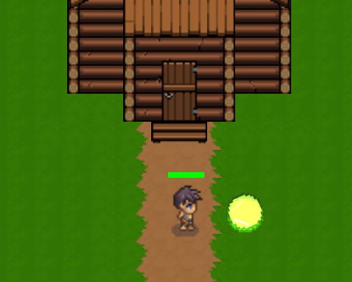

# Perubahan untuk UAS
**task**: tambah fitur pickup health

Task diimplementasikan dengan membuat Scene baru yaitu `HealingOrb` yang kemudian dikaitkan dengan script untuk implementasi healing orb nya. Healing Orb tersebar di map dengan menaruh scene Healing Orb pada main level secara manual. Kemudian, untuk polishing Healing Orb diimplementasikan PointLight untuk penambahan cahaya dan Audio untuk prompt ketika Healing Orb diambil

## Struktur Scene
```
HealingOrb (Area2D)
-- Sprite2D
-- CollisionShape2D (pada layer 2 untuk mendeteksi player)
-- PointLight2D
-- AudioStreamPlayer2D
```

## Script `healing_orb.gd`
| Property | Default | Deskripsi |
|------|------|------|
| heal_amount | 25 | Jumlah HP yang ditambahkan ke player |
| float_amplitude | 5.0 | Seberapa tinggi naik-turun orb (pixel) |
| float_speed | 2.0 | Kecepatan animasi float |

## Dokumentasi perubahan


# List Aset

## Tilemap
- **Pixel Crawler**  
  https://anokolisa.itch.io/free-pixel-art-asset-pack-topdown-tileset-rpg-16x16-sprites

## Forest Object
- **CraftPix – Free Forest Objects (Top Down Pixel Art)**  
  https://craftpix.net/freebies/free-forest-objects-top-down-pixel-art/?num=1&count=127&sq=forest%20object&pos=2

## Character
- **CraftPix – Free Swordsman 1–3 Level Pixel Top Down Sprite Character Pack**  
  https://craftpix.net/freebies/free-swordsman-1-3-level-pixel-top-down-sprite-character-pack/

## Enemy / Monster
- **CraftPix – Free Predator Plant Mobs Pixel Art Pack**  
  https://craftpix.net/freebies/free-predator-plant-mobs-pixel-art-pack/

- **CraftPix – Free Top Down Orc Game Character Pixel Art**  
  https://craftpix.net/freebies/free-top-down-orc-game-character-pixel-art/
